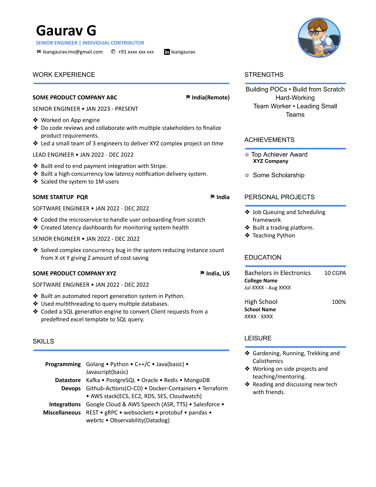

# Resume

This repo contains resume templates built using Google Docs. 
- These are easy to customize and use.
- Simple: no need to learn LaTeX (LaTeX is great, but takes initial time investment).
- Access anywhere. Stored in Goole Docs ☁. 

**Note:** While opening on phone, use print layout to see how it's going to look. Still Mobile view might have issues, so view on Desktop/Laptop or use `Desktop View` in mobile browser. Also see tips section  
*Remember to Star/Watch the repo for updates !!*

 

## How To

### Use the templates 
To use the templates, make a copy of any given template by following the below steps:
- Click to open one of the template links
- In the opened google doc, click on "*File->Make a Copy*"
- Edit your copy

To create more sections with same formatting, copy and paste any existing section (header + separator line + content/bullets).

### Download as PDF
Prefer sending a PDF file instead of sharing a link to the google doc or sending it in doc format since formatting might look very different on viewers system.

To convert go to "*File->Download->PDF*"

### Change the theme color  
- For each component having colors, select -> right click -> Edit -> Make changes 
  or check the video
- Suggested colors

|   | Code  |
|---|-------|
| $\color{#EA4E4E}{⬤}$  |   #EA4E4E |
| $\color{#4A86E8}{⬤}$  |   #4A86E8 |
| $\color{#19a15f}{⬤}$  |   #19a15f |
| $\color{#460094}{⬤}$  |   #460094 |

 
 

# Available Templates  
**One Page Templates**  
|  |  |
|--|--|
| | [Internship Template-1 Click to Open](https://docs.google.com/document/d/1LYLavLKSktx72tVbLdDWE8kkRFZi4iNgEuFUF4-Jlfk) |
| | [Software Engineer Template-1 Click to Open](https://docs.google.com/document/d/12VKwOvPnLgnE_zsFa1UYK3yZ30qsT9-k6uogBVpYLwc) |
| | [Software Engineer Template-2 Click to Open](https://docs.google.com/document/d/1wfkEG4Xyh24PpT_IQlOtC9ee_lfN_OPHIMgVauWIsuE) |
| | [Software Engineer Template-3 Click to Open](https://docs.google.com/document/d/1W7rXRlcVjNUmGRlmOjBvzdrTv5u-0wH3JeWUnWVXWVo) |
| | [Software Engineer Template-4 Click to Open](https://docs.google.com/document/d/1cKGKqau_Q0f_DiI7437XQz8KhNB51pQkkF1zWbj4e-0) |
| | [Software Engineer Template-5 Click to Open](https://docs.google.com/document/d/1yx-bhUF91xeq-mwlk2iAmU3pEUzkqeFKIuBlVT2gKjI) |
| | [Software Engineer Template-6 Click to Open](https://docs.google.com/document/d/1KidWo6_xZVes8d-NE9dlpD7jNMYrTHWAGZMKXIBVZV8) |
| | [Software Engineer Template-7 Click to Open](https://docs.google.com/document/d/1_xOQAbhmIRtDXdonKMamuKOzzhUq7Ab0P_X7SPGx_g4) |

**Multi-Page Templates**  
|  |  |
|--|--|
| | [Software Engineer Template-Long-1 Click to Open](https://docs.google.com/document/d/1EsQ8B6kjdKgIl80ItObIk414J84i3sSPCVVGPkQ4MPI) |

---

### Have some suggestions
Open an issue !!

---

